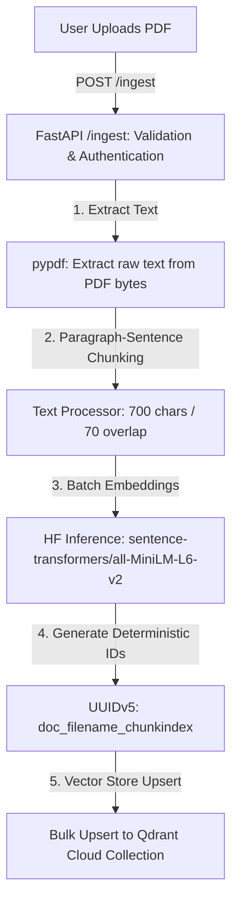

# Synapse: Hybrid Conversational RAG Engine

A production-ready, cloud-native Retrieval-Augmented Generation (RAG) platform that fuses semantic dense embeddings with exact full-text payload indexing, resolving user queries with zero hallucination.


---

## 📋 Table of Contents
* [Overview](#-overview)
* [Key Features](#-key-features)
* [System Architecture](#️-system-architecture)
* [Tech Stack](#️-tech-stack)
* [Folder Structure](#-folder-structure)
* [RAG Pipeline Deep Dive](#-rag-pipeline-deep-dive)
* [API Endpoints](#-api-endpoints)
* [Environment Variables](#-environment-variables)
* [Getting Started](#-getting-started)
* [Design Decisions & Trade-offs](#-design-decisions--trade-offs)

---

## 🌟 Overview
Synapse is a high-performance conversational search system designed to extract, index, and query information from large document stores (like PDFs). 

### The Problem It Solves
Standard vector search frequently misses exact keyword terms (like specific codes, SKUs, or product names) because of dense embedding generalizations. On the other hand, traditional keyword search lacks semantic nuance. Synapse solves this by implementing **Hybrid Search (Dense Cosine Similarity + Sparse Text Match)** merged through **Reciprocal Rank Fusion (RRF)**.

Both features (PDF ingestion and conversational chat) run on top of an API key-protected layer, ensuring secure endpoint access.

---

## ✨ Key Features
*   **Idempotent PDF Ingestion:** Processes multi-page PDF documents, chunks them using paragraph-sentence alignment, generates dense vectors, and stores them under deterministic UUIDv5 IDs to prevent index duplicates.
*   **Dual-Engine Hybrid Retrieval:** Runs semantic query matching on Qdrant vectors alongside lexical keyword matching on payload indexes.
*   **Scoring & Fusion:** Employs Reciprocal Rank Fusion (RRF) to merge and normalize scores from vector and keyword search paths.
*   **Hallucination-Blocker Safeguards:** Aborts LLM completion calls when the maximum RRF relevance score fails to satisfy the minimum confidence threshold (`LOW_CONFIDENCE_THRESHOLD`), returning a safe fallback.
*   **Heuristic Query Context-Rewriting:** Deterministically resolves pronouns (like "it", "this", "that") from conversational context without triggering costly LLM processing.
*   **Completion Routing:** Uses Hugging Face Serverless LLMs (e.g., Qwen 2.5) using your `HF_TOKEN`.
*   **Modern Interactive UI:** React single-page app styled with a modern glassmorphism layout, featuring real-time stream-rendered chat replies and asynchronous file upload feedback.

---

## 🏗️ System Architecture

### High-Level Component Relationship


### RAG Data Flow Flowchart


---

## 🛠️ Tech Stack

### Backend & API
| Technology | Purpose |
| :--- | :--- |
| **FastAPI** | High-performance ASGI Python framework with native async support and automatic OpenAPI documentation. |
| **Uvicorn** | High-efficiency ASGI web server implementation. |
| **Pydantic v2** | Strict type-checking, data validation, and settings management schemas. |
| **pypdf** | High-efficiency parser library to read and extract text from PDF files. |
| **python-dotenv** | Environment configuration variables parser. |

### AI / LLM / Vector DB
| Technology | Purpose |
| :--- | :--- |
| **Qdrant Cloud** | Cloud-native vector search engine supporting dense vectors and full-text payload indexing. |
| **Hugging Face Serverless API** | Generates 384-dimensional dense vectors using `sentence-transformers/all-MiniLM-L6-v2`. |
| **Hugging Face Serverless (Qwen 2.5)** | Primary LLM provider (`Qwen/Qwen2.5-7B-Instruct`) for completions. |

### Frontend Client
| Technology | Purpose |
| :--- | :--- |
| **React 18 & Vite** | Core frontend UI library and rapid hot-module replacement (HMR) bundler. |
| **Axios** | Promise-based HTTP client for interacting with the backend API. |
| **Vanilla CSS** | Custom responsive layout with modern typography, glassmorphism, and transitions. |

---

## 📁 Folder Structure

Below is the repository structure containing backend code, frontend interface, and test modules:

```
rag-main/
├── .env.example            # Environment configuration template
├── .gitignore              # Ignored files template for Git
├── requirements.txt        # Runtime and test dependency package manifests
├── README.md               # Production-grade documentation (this file)
├── context.md              # System architecture reference map
├── app/                    # FastAPI Python Backend
│   ├── main.py             # ASGI entrypoint and middleware configurations
│   ├── config.py           # Application configurations and environment constants
│   ├── logger.py           # Custom logging utility
│   ├── auth.py             # API key header-based authentication dependency
│   ├── models/             # Pydantic schema validation structures
│   │   └── request_models.py
│   ├── routes/             # REST routing endpoints
│   │   ├── chat.py         # Conversational RAG pipeline endpoint
│   │   └── ingest.py       # PDF document parser and indexer endpoint
│   ├── services/           # Underlying business logic pipelines
│   │   ├── create_index.py # Script/service to initialize Qdrant database collection
│   │   ├── embedding_service.py # Hugging Face embed retry & batch logic
│   │   ├── fusion_service.py    # Reciprocal Rank Fusion implementation
│   │   ├── ingest_service.py    # Ingestion orchestration logic
│   │   ├── llm_service.py       # Hugging Face completions client
│   │   ├── qdrant_service.py    # Qdrant client connection and search hooks
│   │   └── search_service.py    # Combines vector and lexical search runs
│   └── utils/              # Helper utility modules
│       └── query_utils.py  # Conversational history query refiner (pronoun resolution)
├── frontend/               # React client SPA source code
│   ├── package.json        # Frontend dependencies & run scripts
│   ├── index.html          # Main HTML entry point
│   ├── vite.config.js      # Vite configuration file
│   └── src/
│       ├── App.css         # Component and chat layouts styling
│       ├── App.jsx         # Chat interface and API logic
│       ├── index.css       # Core typography systems and resets
│       └── main.jsx        # React entrypoint
└── tests/                  # Pytest test cases
    ├── conftest.py         # Mock programmatic PDF fixtures
    └── test_embedding.py   # Embedding pipeline validation tests
```

---

## 🔬 RAG Pipeline Deep Dive

### 1. Ingestion & Idempotent Vector Upsert
*   **PDF Extraction:** The PDF is read directly from memory bytes, and text is extracted page by page using `pypdf`.
*   **Recursive Chunking:** Text is broken into chunks of `700` characters with a sliding overlap of `70` characters. Chunking heuristics prioritize sentence and paragraph boundaries to preserve semantic context.
*   **Hugging Face Batch Embedding:** Chunks are grouped into batches (default size `5`) and sent to the Hugging Face Serverless Inference API using `sentence-transformers/all-MiniLM-L6-v2` to generate 384-dimensional dense vectors.
*   **Deterministic UUIDv5 Generation:** To prevent duplicate document uploads and data drift, a deterministic coordinate ID is created using the naming scheme: `doc_{filename}_{chunk_index}`. Re-uploading a file with the same name replaces existing vectors at those identical coordinates.

### 2. Dual-Engine Retrieval & Fusion
*   **Semantic Query Matching:** The user's query is embedded, and a cosine-similarity k-NN search is run against Qdrant to retrieve the top dense hits.
*   **Lexical MatchText Search:** In parallel, a search is performed using Qdrant's `scroll` query filtering text payload entries in the `combined` keyword index.
*   **Reciprocal Rank Fusion (RRF):** The rankings are combined using the formula:
    $$RRF\_Score(d) = \sum_{m \in M} \frac{1}{60 + r_m(d)}$$
    where $M$ consists of vector search and keyword search.

### 3. Confidence Safeguard Threshold
Before invoking the LLM, the highest-scoring candidate is checked. If the RRF score is below `LOW_CONFIDENCE_THRESHOLD` (default `0.015`), the query is aborted. This blocks hallucinated responses and returns a generic fallback (`"No relevant context found."`).

---

## 📡 API Endpoints

### Route Security
Routes accept an optional API key in the `X-API-Key` header. If `API_ACCESS_KEY` is not set in `.env` (empty string), authentication check passes silently.

| Method | Endpoint | Description | Auth Headers | Request Payload | Response Schema |
| :--- | :--- | :--- | :--- | :--- | :--- |
| **POST** | `/ingest` | Parse PDF, chunk, embed, and index in Qdrant | `X-API-Key` (Optional) | Multipart `file: UploadFile` | `{"status": "success", "file": str, "chunks_indexed": int}` |
| **POST** | `/chat` | Context-aware RAG search and answer generation | `X-API-Key` (Optional) | `ChatRequest` JSON payload | `{"reply": str, "llm_called": bool, "hits_used": int, "max_score": float}` |

---

## 🔑 Environment Variables

Create a `.env` file in the root directory. Below are the variables required:

| Variable | Description | Default / Example Value |
| :--- | :--- | :--- |
| `QDRANT_URL` | Qdrant database server URL | `http://localhost:6333` |
| `QDRANT_API_KEY` | Access token key for Qdrant Cloud | `your_qdrant_api_key_here` |
| `INDEX_NAME` | Name of the collection in Qdrant database | `data_store` |
| `HF_TOKEN` | Hugging Face Access Token | `hf_your_token_here` |
| `HF_EMBEDDING_API_URL` | Embeddings model endpoint url | `https://router.huggingface.co/hf-inference/...` |
| `HF_LLM_MODEL` | Hugging Face LLM model name | `Qwen/Qwen2.5-7B-Instruct` |
| `LOW_CONFIDENCE_THRESHOLD` | Guard threshold score to prevent hallucinations | `0.015` |
| `MAX_CONTEXT_DOCS` | Upper limit of context documents fed to prompt | `20` |
| `INGEST_BATCH_SIZE` | Chunk count size limit for embedding requests | `5` |
| `API_ACCESS_KEY` | Token key for route header security | `leave_empty_for_no_auth` |

---

## 🚀 Getting Started

### Prerequisites
*   Python 3.10+
*   Node.js v18+ & npm
*   A Qdrant instance (Local via Docker or Cloud account)

### Backend Setup
1.  **Create and activate a virtual environment:**
    ```powershell
    python -m venv .venv
    .venv\Scripts\activate      # Windows Powershell
    # source .venv/bin/activate  # macOS / Linux
    ```
2.  **Install dependencies:**
    ```powershell
    pip install -r requirements.txt
    ```
3.  **Configure environment variables:**
    Create your `.env` file based on the [Environment Variables](#-environment-variables) section.
4.  **Initialize Vector Collection:**
    ```powershell
    python -m app.services.create_index
    ```
5.  **Start development server:**
    ```powershell
    uvicorn app.main:app --reload --host 127.0.0.1 --port 8000
    ```
    FastAPI interactive documentation is generated at [http://127.0.0.1:8000/docs](http://127.0.0.1:8000/docs).

### Frontend Setup
1.  **Navigate to the frontend folder:**
    ```powershell
    cd frontend
    ```
2.  **Install client packages:**
    ```powershell
    npm install
    ```
3.  **Start Vite dev server:**
    ```powershell
    npm run dev
    ```
    The UI will be accessible at [http://localhost:5173](http://localhost:5173).

### Running Tests
Activate the virtual environment and run the test suite with pytest:
```powershell
pytest tests/ -v
```

---

## 📐 Design Decisions & Trade-offs
*   **FastAPI & Uvicorn Async Bounds:** Heavy CPU-bound embedding calls and database requests are wrapped using Python's `loop.run_in_executor` block to keep FastAPI's async thread loop non-blocking and ultra-responsive.
*   **Unified DB Search with Qdrant:** Rather than combining a distinct semantic search engine (e.g. Pinecone) with an external text index engine (e.g. Elasticsearch), Qdrant provides both dense index k-NN search and sparse keyword scroll indexing under a single engine.
*   **Hugging Face Serverless Inference:** Reduces workspace setup overhead and GPU requirements by routing sentence-transformers embeddings and LLM completions remotely. Network transient issues are managed using automated 429/503 retry and backoff mechanisms.
*   **Heuristic Context-Aware Pronoun Rewriter:** Improves multi-turn RAG conversation accuracy by resolving ambiguous query pronouns locally, bypassing costly pre-query LLM rewriting pipelines.
*   **RRF Score Calibration:** Because Reciprocal Rank Fusion uses a rank-based ordinal approach rather than exact cosine similarities, setting absolute threshold boundaries (`LOW_CONFIDENCE_THRESHOLD`) requires empirical tuning to prevent incorrect context blocking.
