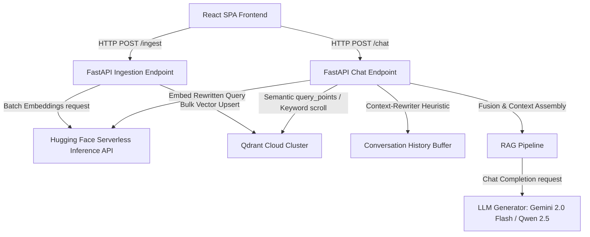

# Synapse: Hybrid Conversational RAG Engine

A production-ready, cloud-native Retrieval-Augmented Generation (RAG) platform that fuses semantic dense embeddings with exact full-text payload indexing, resolving user queries with zero hallucination.

---

## 1. Overview

Synapse is an AI-powered conversational search system designed to extract, index, and query information from large document stores (like PDFs). It targets developers, data operators, and technical teams looking for a reliable, performant, and quota-safe RAG workflow.

### The Problem it Solves
Standard vector search frequently misses exact keyword terms (like specific codes, SKUs, or product names) because of dense embedding generalizations. On the other hand, traditional keyword search lacks semantic nuance. Synapse solves this by implementing **Hybrid Search (Dense Cosine Similarity + Sparse Text Match)** merged through **Reciprocal Rank Fusion (RRF)**.

### Major Capabilities
*   **Idempotent PDF Ingestion:** Processes multi-page PDF documents, chunks them using paragraph-sentence alignment, generates dense vectors, and stores them under deterministic IDs to prevent index duplicates.
*   **Heuristic Query Context-Rewriting:** Deterministically resolves pronouns (like "it", "this", "that") from conversational context without triggering costly LLM processing.
*   **Dual-Engine Hybrid Retrieval:** Runs semantic query matching on Qdrant vectors alongside lexical keyword matching on payload indexes.
*   **Hallucination-Blocker Safeguards:** Aborts LLM completion calls when the maximum RRF relevance score fails to satisfy the minimum threshold, ensuring the system only returns grounded facts.
*   **Flexible Completion Routing:** Automatically uses Google AI Studio's Gemini 2.0 Flash or falls back to Hugging Face Serverless LLMs (e.g. Qwen 2.5) using your existing `HF_TOKEN`.

---

## 2. Features

*   **Document Processing:** Robust PDF parser (`pypdf`), chunking with custom size (700 characters) and overlap (70 characters).
*   **Vector Search:** Full Qdrant Cloud integration, deterministic uuid5 coordinate points generation, dynamic collection creation, and index configuration.
*   **Lexical Indexing:** Custom payload keyword matching on the `combined` text schema.
*   **Scoring & Fusion:** Reciprocal Rank Fusion (RRF) combining vector rankings and keyword search outputs.
*   **Conversation Memory:** Clean browser session caching with 50-message context limitations and heuristic pronoun resolution.
*   **Error Handling:** Retry backoff logic (rate-limit 429/503 handling) for external Hugging Face inference requests.
*   **User Experience:** Stream-rendered bot responses for real-time visual feedback, and session history management.

---

## 3. System Architecture



*   **Frontend:** A responsive Single Page Application (SPA) built using Vite and React, communicating with the backend over REST endpoints via Axios.
*   **FastAPI Backend:** Handles ingestion and query parsing async boundaries, keeping response latencies low.
*   **Embedding Pipeline:** Coordinates batches with Hugging Face's `all-MiniLM-L6-v2` via Serverless Inference.
*   **Search Engine:** Stores vectors (384 dimensions) and payloads inside Qdrant Cloud.
*   **LLM Completion:** Grounds prompts and queries them to Gemini or Hugging Face.

---

## 4. Technology Stack

### Frontend
*   **Vite + React (v18)**: Core framework and fast build tooling.
*   **Axios**: Promise-based HTTP client for API interactions.
*   **Vanilla CSS**: Custom responsive layout stylesheet.

### Backend
*   **FastAPI**: High-performance ASGI Python framework.
*   **Uvicorn**: Lightning-fast ASGI web server implementation.
*   **Pydantic (v2)**: Strict type-checking and data validation schemas.
*   **pypdf**: High-efficiency PDF parsing library.
*   **python-dotenv**: Environment file configurations parser.

### AI / LLM / Embeddings
*   **Hugging Face Serverless Inference API**: Powering embeddings (`sentence-transformers/all-MiniLM-L6-v2`) and fallback chat completions (`Qwen/Qwen2.5-7B-Instruct`).
*   **Google AI Studio (Gemini 2.0 Flash)**: High-speed primary LLM provider.

### Vector Database
*   **Qdrant Cloud (Free tier)**: Multi-tenant vector collection, indexing, and payload filtering.

---

## 5. Folder Structure

```
rag-main/
├── .env.example            # Environment configuration template
├── .gitignore              # Ignored files template for Git
├── requirements.txt        # Runtime and test dependency package manifests
├── README.md               # Production-grade documentation
├── context.md              # System architecture reference map
├── app/                    # Backend application source code
│   ├── config.py           # Application configurations and environment constants
│   ├── logger.py           # Custom logging utility
│   ├── main.py             # ASGI entrypoint and middleware configurations
│   ├── models/             # Pydantic schema validation structures
│   │   └── request_models.py
│   ├── routes/             # REST routing endpoints
│   │   ├── chat.py         # Conversational RAG pipeline endpoint
│   │   └── ingest.py       # PDF document parser and indexer endpoint
│   ├── services/           # Underlying business logic pipelines
│   │   ├── create_index.py
│   │   ├── embedding_service.py # Hugging Face embed retry & batch logic
│   │   ├── fusion_service.py    # Reciprocal Rank Fusion implementation
│   │   ├── ingest_service.py
│   │   ├── llm_service.py       # Gemini and Hugging Face completions client
│   │   ├── qdrant_service.py    # Qdrant client connection and search hooks
│   │   └── search_service.py    # Combines vector and lexical search runs
│   └── utils/              # Helper utility modules
│       └── query_utils.py  # Conversational history query refiner
├── frontend/               # React client SPA source code
│   ├── package.json
│   ├── index.html
│   ├── vite.config.js
│   └── src/
│       ├── App.css         # Component and chat layouts styling
│       ├── App.jsx         # Chat interface and API logic
│       ├── index.css       # Core typography systems and layout resets
│       └── main.jsx
└── tests/                  # Pytest test cases
    ├── conftest.py         # Mock programmatic PDF fixtures
    └── test_embedding.py   # Embedding pipeline validation tests
```

---

## 6. RAG Pipeline Deep Dive

### Ingestion Flow Diagram
```
[PDF File] 
   │
   ▼
[Text Extraction (PdfReader)]
   │
   ▼
[Chunking Heuristics (700 Chars / 70 Overlap)]
   │
   ▼
[Hugging Face Embedding Batches (all-MiniLM-L6-v2)]
   │
   ▼
[PointStruct Construction (uuid5 deterministic IDs)]
   │
   ▼
[Bulk Upsert to Qdrant Cloud]
```

1.  **PDF Parsing:** When a PDF is posted to `/ingest`, raw bytes are read into `PdfReader` to extract textual page characters.
2.  **Paragraph-Sentence Chunking:** Text is split using paragraph boundaries (`\n\n`) and sentence delimiters, grouping sentences up to `700` characters, keeping a `70` character overlap to maintain semantic continuity.
3.  **Hugging Face Inference Batching:** Chunks are sent in configurable batches (default `5` per request) to `https://router.huggingface.co/hf-inference/models/sentence-transformers/all-MiniLM-L6-v2/pipeline/feature-extraction`.
4.  **Idempotence Guardrails:** For each chunk, a deterministic namespace UUIDv5 is generated using the schema: `doc_{filename}_{chunk_index}`. If a file is uploaded again, it updates the existing points instead of creating duplicates.
5.  **Vector Store Upsert:** Vectors and payloads (containing the source file name and text) are bulk-written to Qdrant Cloud.

---

## 7. Retrieval & Chat Workflow

1.  **Heuristic Query Rewriting:** The user message is checked for pronouns. If found, Synapse scans the history and replaces pronouns with the resolved entity.
2.  **Semantic Search:** The query is embedded via Hugging Face and sent to Qdrant using the `query_points` API.
3.  **Lexical Keyword Search:** In parallel, if an entity is extracted, a Qdrant `scroll` query matching `MatchText` filters values on the `combined` text payload.
4.  **Reciprocal Rank Fusion (RRF):** The rankings are combined using the formula:
    $$RRF\_Score(d) = \sum_{m \in M} \frac{1}{60 + r_m(d)}$$
5.  **Confidence Block:** If the top-scoring document has an RRF score below `LOW_CONFIDENCE_THRESHOLD` (default `0.015`), the query is aborted, and `"No relevant context found."` is returned immediately without contacting the LLM.
6.  **Prompt Construction:** The top matching documents are assembled into system instructions and sent to the LLM (Gemini or Hugging Face) for answer completion.

---

## 8. API Documentation

| Method | Route | Description | Auth | Request Body | Response Schema |
| :--- | :--- | :--- | :--- | :--- | :--- |
| **POST** | `/ingest` | Parse PDF, chunk, embed, and index in Qdrant. | None | `file: UploadFile` (Multipart) | `{"status": "success", "file": str, "chunks_indexed": int, ...}` |
| **POST** | `/chat` | Conversational RAG search and answer generation. | None | `{"messages": list, "top_k": int}` | `{"reply": str, "llm_called": bool, "hits_used": int, ...}` |

---

## 9. Environment Variables

Create a `.env` file in the root directory. Below are the variables required:

```dotenv
# ── Vector Store (Qdrant Cloud) ───────────────────────────────────
QDRANT_URL=https://<your-cluster-id>.<region>.gcp.cloud.qdrant.io
QDRANT_API_KEY=<your-qdrant-cloud-api-key>
INDEX_NAME=data_store

# ── Embedding (Hugging Face Serverless Inference) ─────────────────
HF_TOKEN=hf_<your-huggingface-token>
# Optional override:
# HF_EMBEDDING_API_URL=https://router.huggingface.co/hf-inference/models/sentence-transformers/all-MiniLM-L6-v2/pipeline/feature-extraction

# ── LLM (Gemini 2.0 Flash OR Hugging Face Serverless) ─────────────
LLM_PROVIDER=gemini # "gemini" or "huggingface"
GEMINI_API_KEY=AIza<your-google-ai-studio-api-key>
# If LLM_PROVIDER=huggingface, specify the model:
HF_LLM_MODEL=Qwen/Qwen2.5-7B-Instruct

# ── RAG Thresholds & Ingestion Tuning ─────────────────────────────
LOW_CONFIDENCE_THRESHOLD=0.015
MAX_CONTEXT_DOCS=20
INGEST_BATCH_SIZE=5
MAX_EMBED_RETRIES=3
```

---

## 10. Installation & Run Guide

### Prerequisites
*   Python 3.10+
*   Node.js v18+ & npm

### Backend Setup
1.  Navigate to root and create a virtual environment:
    ```powershell
    python -m venv .venv
    .venv\Scripts\activate
    ```
2.  Install dependencies:
    ```powershell
    pip install -r requirements.txt
    ```
3.  Configure your environment variables inside a `.env` file.
4.  Start FastAPI:
    ```powershell
    uvicorn app.main:app --reload --host 127.0.0.1 --port 8000
    ```

### Frontend Setup
1.  Navigate to the `frontend` folder:
    ```powershell
    cd frontend
    ```
2.  Install packages:
    ```powershell
    npm install
    ```
3.  Start the Vite dev server:
    ```powershell
    npm run dev
    ```

---

## 11. Design Decisions

*   **FastAPI & Uvicorn:** Chosen for native async concurrency, Pydantic type safety, and automatic OpenAPI schema validation.
*   **Qdrant Cloud:** Outperforms traditional vector databases. Provides high-speed semantic matching (`query_points`) and full-text keyword indexing (`scroll` with text filters) in one place.
*   **Hugging Face Serverless:** Replaces heavy local Python dependencies like `torch` and `transformers`. Features rate-limit retry protection on 429/503 responses, and falls back to serial queries on payload-too-large (413) responses.
*   **Heuristic Context Rewriter:** Minimizes RAG latency by resolving ambiguous query pronouns via regex pattern checks, avoiding the cost of a LLM rewriting pass.

---

## 12. Testing

A clean test suite is implemented using `pytest` and `unittest.mock` to validate the embedding service without consuming API quotas.

### Running Tests
Activate your virtual environment and run:
```powershell
pytest tests/ -v
```

---

## 13. License

This project is licensed under the MIT License. See [LICENSE](LICENSE) for details.
