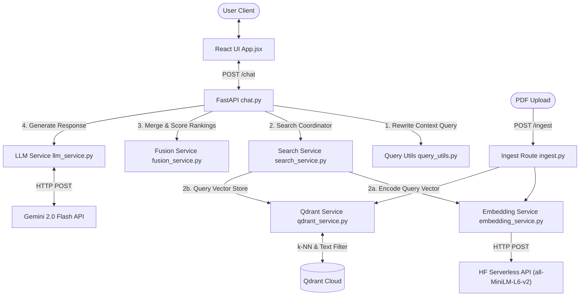
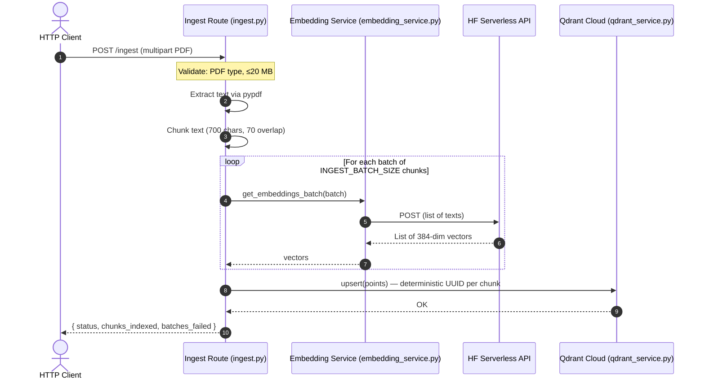

# Context: Hybrid Conversational RAG System

This document provides a comprehensive technical overview of the Hybrid Conversational RAG (Retrieval-Augmented Generation) codebase. It is designed to help engineers quickly understand the architectural patterns, data flow, repository layout, and setup process.

---

## 1. Project Overview

The project is a **Hybrid Conversational RAG System** backend and frontend application designed for high-accuracy, context-aware query response generation over enterprise knowledge bases.

### Core Value Proposition
Traditional Retrieval-Augmented Generation (RAG) pipelines often struggle with conversational context in multi-turn interactions (e.g., handling follow-up questions containing pronouns like *"How does it scale?"*) and can suffer from low precision when relying solely on semantic dense vectors.

This system solves these issues through:
1. **Context-Aware Query Rewriting**: Evaluates user chat histories to detect pronouns and rewrite ambiguous queries (e.g., converting *"How does it scale?"* to *"How does Kubernetes scale?"*) before executing search requests.
2. **Hybrid Search Strategy**: Blends semantic dense vector search (cosine k-NN similarity) with exact, fuzzy keyword search (text payload filter) inside Qdrant to capture both structural meanings and domain-specific terminology.
3. **Robust Score Fusion**: Employs Reciprocal Rank Fusion (RRF) to merge and normalize scores from vector and keyword search paths, resulting in a single highly relevant set of context documents.
4. **Hallucination Prevention**: Restricts LLM calls by validating maximum retrieval confidence scores against a configurable threshold. If search context is insufficient, it bypasses LLM inference entirely and returns a safe fallback message.

### Target Audience & Use Case
- Enterprise knowledge hubs requiring conversational interfaces.
- Technical documentation search (e.g., searching complex developer documentation with precise keywords and acronyms).
- Customer support workflows where multi-turn history matters.

---

## 2. System Architecture

The codebase follows a modular, service-oriented architecture separating UI components, API route endpoints, and individual RAG sub-services.

### Tech Stack Breakdown
*   **Frontend**: React (SPA), Vite, Axios for API calls, and Vanilla CSS for user interface layout.
*   **Backend Framework**: FastAPI (running on Uvicorn), utilizing Pydantic for automated request schema validation.
*   **Vector Embeddings**: Remote **Hugging Face Serverless Inference API** using `sentence-transformers/all-MiniLM-L6-v2` (384-dimensional output). No local model or GPU required.
*   **Vector Database**: **Qdrant** (cloud free tier or self-hosted), configured for cosine-similarity k-NN search and full-text payload keyword filtering.
*   **LLM Integration**: **Gemini 2.0 Flash** via Google AI Studio API (free tier).

### Component Relationship Map
The diagram below illustrates how components interact during a user query lifecycle.



---

## 3. Core Workflows & Data Flow

### 3a. Chat Request Lifecycle

```mermaid
sequenceDiagram
    autonumber
    actor User as User UI
    participant Route as Chat API (chat.py)
    participant Utils as Query Utils (query_utils.py)
    participant Search as Search Coordinator (search_service.py)
    participant Embed as Embedding Service (embedding_service.py)
    participant HF as HF Serverless API
    participant Qdrant as Qdrant Cloud (qdrant_service.py)
    participant Fusion as Fusion Service (fusion_service.py)
    participant LLM as Gemini 2.0 Flash (llm_service.py)

    User->>Route: POST /chat (messages history)
    Route->>Utils: rewrite_query_with_context(messages)
    Note over Utils: Extract topic entity from history;<br/>Replace pronouns (it, this) with entity.
    Utils-->>Route: Cleaned/Rewritten Query
    Route->>Search: run_search(query, top_k)
    Search->>Embed: get_embedding(query)
    Embed->>HF: POST all-MiniLM-L6-v2
    HF-->>Embed: 384-dim vector
    Embed-->>Search: query_vector
    Search->>Qdrant: semantic_search(vector)
    Search->>Qdrant: keyword_search(query) [if entity found]
    Qdrant-->>Search: Vector Hits & Keyword Hits
    Search-->>Route: Combined raw search lists
    Route->>Fusion: rrf_fusion(vector_hits, keyword_hits)
    Note over Fusion: Score = sum( 1 / (60 + rank + 1) )
    Fusion-->>Route: Sorted, fused hits list

    alt Max Score < LOW_CONFIDENCE_THRESHOLD
        Route-->>User: "No relevant context found." (LLM skipped)
    else Confidence OK
        Route->>LLM: call_llm(context_prompt + history)
        LLM-->>Route: Grounded Assistant Reply
        Route-->>User: Final Response (reply, hits_used, max_score)
    end
```

### 3b. PDF Ingestion Flow (POST /ingest)



### Detailed Workflow Step-by-Step

1.  **Request Input**: The client sends the complete chat history (a list of messages) via the React client ([App.jsx](file:///c:/Users/BIT/Desktop/rag-main/frontend/src/App.jsx)) to the `/chat` route.
2.  **Context Analysis**: In [query_utils.py](file:///c:/Users/BIT/Desktop/rag-main/app/utils/query_utils.py), the system checks if the latest user question contains pronouns (`it`, `this`, `that`, `they`, `them`). If so, it traverses historical user turns to extract the query entity. The query is then rewritten using this entity.
3.  **Embedding Generation**: The rewritten query is sent to [embedding_service.py](file:///c:/Users/BIT/Desktop/rag-main/app/services/embedding_service.py), which calls the **HF Serverless Inference API** for `all-MiniLM-L6-v2` to return a 384-dimensional dense vector. Requests include automatic retry with exponential backoff on rate-limit (429) and cold-start (503) responses.
4.  **Parallel Retrieval**: [search_service.py](file:///c:/Users/BIT/Desktop/rag-main/app/services/search_service.py) fires two separate searches against Qdrant via [qdrant_service.py](file:///c:/Users/BIT/Desktop/rag-main/app/services/qdrant_service.py):
    *   *Semantic Search*: Performs a cosine k-NN search against the vector index.
    *   *Keyword Search*: If the utility detects a distinct entity in the query, it executes a text match scroll filter on the `combined` payload field.
5.  **Ranking Fusion**: Results are merged in [fusion_service.py](file:///c:/Users/BIT/Desktop/rag-main/app/services/fusion_service.py) using the **Reciprocal Rank Fusion (RRF)** algorithm.
6.  **Confidence Verification**: The maximum fusion score is validated against `LOW_CONFIDENCE_THRESHOLD` (defined in [config.py](file:///c:/Users/BIT/Desktop/rag-main/app/config.py)). If below the limit, the pipeline short-circuits and returns a safe fallback message.
7.  **Prompt Assembly**: If valid, the text contents of the top `MAX_CONTEXT_DOCS` are compiled with system instructions and the conversation's active context window (last 3–4 turns), and sent to the LLM via [llm_service.py](file:///c:/Users/BIT/Desktop/rag-main/app/services/llm_service.py).
8.  **Output Stream**: The frontend receives the finalized reply and simulates a real-time character-by-character streaming animation.

---

## 4. Key Directory & File Structure

```
rag-main/
├── app/                              # FastAPI Backend Source
│   ├── models/
│   │   └── request_models.py         # Defines ChatRequest schema (messages history, top_k)
│   ├── routes/
│   │   ├── chat.py                   # Chat controller — orchestrates the full RAG pipeline
│   │   └── ingest.py                 # PDF ingestion endpoint (POST /ingest)
│   ├── services/
│   │   ├── embedding_service.py      # HF Serverless Inference API client (get_embedding, get_embeddings_batch)
│   │   ├── fusion_service.py         # Reciprocal Rank Fusion (RRF) algorithm
│   │   ├── ingest_service.py         # CLI ingestion script (alternative to HTTP endpoint)
│   │   ├── create_index.py           # CLI script to create/recreate the Qdrant collection
│   │   ├── llm_service.py            # Gemini 2.0 Flash API client
│   │   ├── qdrant_service.py         # Qdrant client — semantic search, keyword search, collection management
│   │   └── search_service.py         # Coordinator — triggers embedding + dual Qdrant search
│   ├── utils/
│   │   └── query_utils.py            # Rule-based entity extraction and pronoun query rewriting
│   ├── config.py                     # Central configuration (env vars, thresholds, API URLs)
│   ├── logger.py                     # Centralized application logger setup
│   └── main.py                       # FastAPI app initialization, CORS, router registration
│
├── tests/                            # Automated tests
│   ├── conftest.py                   # Pytest fixtures (sample PDF generator)
│   ├── test_embedding.py             # Smoke tests for embedding service
│   └── fixtures/
│       └── __init__.py
│
├── frontend/                         # Vite + React Frontend
│   ├── src/
│   │   ├── App.jsx                   # React Chat UI (session logic, query posts)
│   │   ├── App.css                   # Chat bubble stylesheet
│   │   └── main.jsx                  # React DOM mount
│   └── package.json                  # Node packaging configuration
│
├── requirements.txt                  # Python backend dependencies
├── .env.example                      # Environment variable template
└── context.md                        # This document
```

---

## 5. Development & Setup Quickstart

### Prerequisites
*   Python 3.9 or higher
*   Node.js (v18+)
*   A Qdrant instance (cloud free tier at [cloud.qdrant.io](https://cloud.qdrant.io) or `docker run -p 6333:6333 qdrant/qdrant`)
*   A Hugging Face account with a **Read** token ([huggingface.co/settings/tokens](https://huggingface.co/settings/tokens))
*   A Google AI Studio **Gemini API key** ([aistudio.google.com/apikey](https://aistudio.google.com/apikey)) — key format starts with `AIza`

---

### Step 1: Environment Configuration
1. Copy the environment template:
   ```bash
   cp .env.example .env
   ```
2. Fill in your credentials in `.env`:
   ```dotenv
   QDRANT_URL=https://<your-cluster-id>.<region>.gcp.cloud.qdrant.io
   QDRANT_API_KEY=<your-qdrant-api-key>
   HF_TOKEN=hf_<your-read-token>
   GEMINI_API_KEY=AIza<your-gemini-key>
   ```

---

### Step 2: Backend Setup
1. Install Python dependencies:
   ```bash
   pip install -r requirements.txt
   ```

2. Launch the FastAPI server:
   ```bash
   uvicorn app.main:app --reload --host 127.0.0.1 --port 8000
   ```

3. Verify the API is live at [http://127.0.0.1:8000/docs](http://127.0.0.1:8000/docs)

---

### Step 3: Ingest a PDF Document
Use either the HTTP endpoint (recommended) or the CLI script:

**Option A — HTTP endpoint:**
```bash
curl -X POST http://127.0.0.1:8000/ingest \
  -F "file=@/path/to/your/document.pdf"
```

**Option B — CLI script:**
```bash
python -m app.services.ingest_service --file /path/to/your/document.pdf
```

---

### Step 4: Frontend Setup
1. Navigate to the `frontend` folder:
   ```bash
   cd frontend
   ```

2. Install UI dependencies:
   ```bash
   npm install
   ```

3. Run the local development server:
   ```bash
   npm run dev
   ```

4. Open [http://localhost:5173](http://localhost:5173) in your browser to interact with the system.

